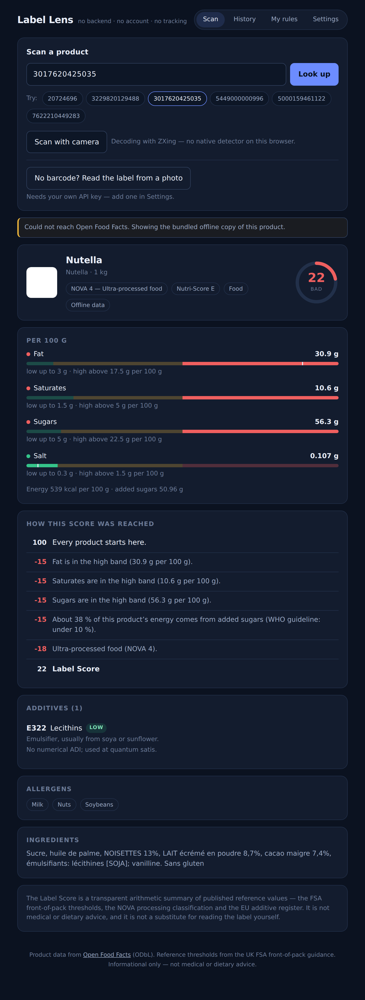
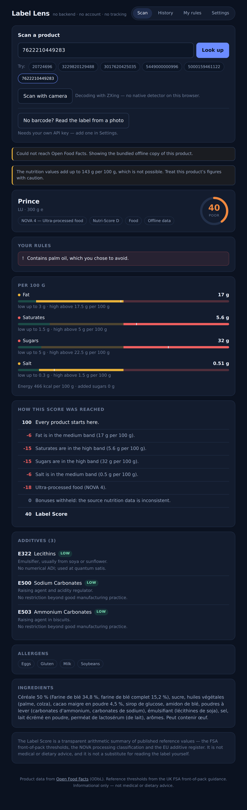

# Label Lens

Scan a barcode, understand the label.

A food label tells you there are 56 g of sugar per 100 g and that the product contains E322. It
does not tell you whether that is a lot, what E322 is, or whether it breaks a rule you set for
yourself. Label Lens does — in about five seconds, with no backend, no account and no tracking.

**Live:** https://REPLACE_ME.github.io/label-lens/


---



---

## What it does

- **Scans a barcode** with the device camera, or takes one typed in.
- **Explains the score.** Every product starts at 100, and every point gained or lost is shown
  as a line item with its reason. There is no hidden model.
- **Traffic lights** for fat, saturates, sugars and salt against the UK FSA front-of-pack
  reference thresholds, halved for drinks as the guidance requires.
- **Additives in plain language** — 76 E-numbers described offline, each with its regulatory
  status rather than a health opinion.
- **Your own rules.** Palm oil, added sugar, vegan, vegetarian, low salt, specific E-numbers.
  These produce flags, never score adjustments, so a rule you care about is never averaged away.
- **Compares two products** side by side.
- **Reads a label from a photo** when a product is not in the database, using your own API key.
- **Works with no network at all** on a bundled set of real products.

## Why the score is trustworthy

The rules are published, cited and unit-tested, and the app shows its arithmetic:

| Rule | Adjustment |
|---|---|
| Nutrient in the medium band | −6 each |
| Nutrient in the high band | −15 each (capped at −60 across the four) |
| Over 10 % / 20 % of energy from added sugars | −8 / −15 |
| NOVA processing group 2 / 3 / 4 | −3 / −8 / −18 |
| Additive of medium / high regulatory concern | −3 / −7 (capped at −20) |
| Fibre ≥ 6 g, protein ≥ 12 g, fruit-veg-nut ≥ 40 % | +5 / +3 / +5 |

Additive concern levels are **regulatory**, never speculative: `high` means banned in the EU,
or carrying a legally mandated label warning, or a declarable allergen. `medium` means a
restricted use, an ADI limit, or an open EFSA re-evaluation.

Open Food Facts is crowd-sourced, so the data sometimes lies — one of the bundled products
claims 52 g of fibre per 100 g, which would earn it a bonus it has not earned. The app detects
macronutrients that cannot add up, says so, and withholds all bonuses for that product while
still applying its penalties.



**This is not medical or dietary advice.** It is a transparent arithmetic summary of published
reference values, and the app says so on the verdict screen.

## Architecture

```
src/core/       pure domain logic — no fetch, no DOM, no storage, no clock
src/adapters/   Open Food Facts, camera, localStorage, model provider
src/ui/         React components, presentation only
src/fixtures/   real captured API responses; powers offline mode and the tests
```

Dependencies point inward only: `ui → adapters → core`. An ESLint rule fails the build if
anything in `core/` imports an adapter, a component, React, or touches a browser global — the
purity of the domain is enforced, not merely intended.

That boundary is what makes the scoring engine testable: **155 unit tests, 99 % line coverage**
on `src/core`, running in a plain Node environment with no DOM and no network.

## Running it

```bash
npm install
npm run dev        # http://localhost:5173
```

```bash
npm test           # unit tests
npm run coverage   # unit tests with a 90 % threshold on src/core
npm run typecheck  # tsc, strict
npm run lint       # eslint, including the architecture boundary rule
npm run build      # production build into dist/
```

Node 22 or newer.

## Deployment

Pushing to `main` runs typecheck, lint, tests and build, then publishes `dist/` to GitHub Pages.
`VITE_BASE` is set from the repository name in CI, so a fork under a different name deploys
correctly without editing anything.

## Reading labels from a photo

The site is static, so there is nowhere to hide a server-side key. The photo feature therefore
uses **your own** API key, entered in Settings and stored in your browser's `localStorage`. It
is sent to the provider you choose and nowhere else. Use a key with a spending limit and remove
it when you are done.

The model is only ever asked to transcribe the printed panel into structured fields. It never
scores anything — that stays in `core/`, where the rules are visible and tested.

## Privacy

There is no backend. The profile, the scan history and the API key live in `localStorage` on
your device. The only outbound requests are to Open Food Facts for product data and, if you
enable it, to your chosen model provider. Settings has a one-click button that erases
everything.

## Data and licences

Product data from [Open Food Facts](https://world.openfoodfacts.org), available under the
[Open Database License](https://opendatacommons.org/licenses/odbl/1-0/). Nutrient thresholds
from the UK Food Standards Agency front-of-pack labelling guidance. Additive information from
the EU food additive register.

Code is MIT licensed — see [LICENSE](LICENSE).

## Built for the Enonic AI Hackathon

Specification in [PRD.md](PRD.md); the working agreement the AI agent followed is in
[CLAUDE.md](CLAUDE.md); the demo script is in [docs/DEMO.md](docs/DEMO.md).
