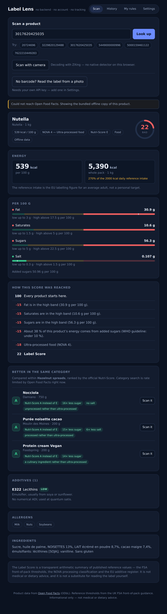

# Label Lens

Scan a barcode, understand the label.

A food label tells you there are 56 g of sugar per 100 g and that the product contains E322. It
does not tell you whether that is a lot, what E322 is, or whether it breaks a rule you set for
yourself. Label Lens does — in about five seconds, with no backend, no account and no tracking.

**Live:** https://sgauruseu.github.io/label-lens/


---


---

## What it does

- **Scans a barcode** with the device camera, or takes one typed in.
- **Calories in the unit you think in.** Per 100 g, and for the whole package — a 1 kg jar of
  Nutella is 5390 kcal, 270 % of the EU daily reference intake. The net quantity is parsed from
  the label text, multipacks (`6 x 33 cl`) and decimal commas (`1,5 L`) included.
- **Explains the score.** Every product starts at 100, and every point gained or lost is shown
  as a line item with its reason. There is no hidden model.
- **Traffic lights** for fat, saturates, sugars and salt against the UK FSA front-of-pack
  reference thresholds, halved for drinks as the guidance requires.
- **Additives in plain language** — 76 E-numbers described offline, each with its regulatory
  status rather than a health opinion.
- **Your own rules.** Palm oil, added sugar, vegan, vegetarian, low salt, specific E-numbers.
  These produce flags, never score adjustments, so a rule you care about is never averaged away.
- **Finds something better in the same category.** Nutella scores 22; the app offers three
  hazelnut spreads with a *sixteenth* of the sugar and no salt at all. Tap one to run the full
  verdict on it, or follow the link to its Open Food Facts page — and to the producer's own
  site when the database has one, which for most products it does not.
- **Compares two products** side by side. The scan history can be cleared in one go, or an
  entry at a time; the sample barcodes on the Scan screen fold away and can be removed
  individually, except the two the demo script depends on.
- **Reads a label from a photo** when a product is not in the database, using your own API key.
- **Works with no network at all** on a bundled set of real products.

## Why the score is trustworthy

The rules are published, cited and unit-tested, and the app shows its arithmetic:

| Rule | Adjustment |
|---|---|
| Nutrient in the medium band | −6 each |
| Nutrient in the high band | −15 each (capped at −60 across the four) |
| Over 10 % / 20 % of energy from added sugars | −8 / −15 |
| NOVA processing group 2 / 3 / 4 | −3 / −8 / −18 |
| Additive of medium / high regulatory concern | −3 / −7 (capped at −20) |
| Fibre ≥ 6 g, protein ≥ 12 g, fruit-veg-nut ≥ 40 % | +5 / +3 / +5 |

Additive concern levels are **regulatory**, never speculative: `high` means banned in the EU,
or carrying a legally mandated label warning, or a declarable allergen. `medium` means a
restricted use, an ADI limit, or an open EFSA re-evaluation.

Open Food Facts is crowd-sourced, so the data sometimes lies — one of the bundled products
claims 52 g of fibre per 100 g, which would earn it a bonus it has not earned. The app detects
macronutrients that cannot add up, says so, and withholds all bonuses for that product while
still applying its penalties.


**This is not medical or dietary advice.** It is a transparent arithmetic summary of published
reference values, and the app says so on the verdict screen.

### Two things the network taught us

Both were established by testing, not by reading documentation, and both changed the design:

- **The modern `/api/v2/search` sends no CORS headers**, and neither does
  `search.openfoodfacts.org`. From a static page they are unusable. The legacy `/cgi/search.pl`
  does allow cross-origin requests, so that is what the alternatives feature uses.
- **Search is rate-limited far harder than product lookup.** Two searches in quick succession
  already fail. So the feature loads on demand rather than on every scan, caches every result
  for the session, walks from the most specific category up when a leaf category is too thin,
  and falls back to a bundled set — which is why it still works with the network unplugged.



## Architecture

```
src/core/       pure domain logic — no fetch, no DOM, no storage, no clock
src/adapters/   Open Food Facts, camera, localStorage, model provider
src/ui/         React components, presentation only
src/fixtures/   real captured API responses; powers offline mode and the tests
```

Dependencies point inward only: `ui → adapters → core`. An ESLint rule fails the build if
anything in `core/` imports an adapter, a component, React, or touches a browser global — the
purity of the domain is enforced, not merely intended.

That boundary is what makes the scoring engine testable: **252 unit tests, 99 % line coverage**
on `src/core`, running in a plain Node environment with no DOM and no network.

## Testing

Two layers, each answering a different question.

**252 unit tests** on `src/core` ask *is the rule right?* — every threshold, every boundary
value, every cap, in Node with no DOM and no network.

**33 UI tests** (Playwright, in `tests/`) ask *did it reach the screen?* — they drive the real
**production build**, not the dev server, so what they exercise is the artefact that gets
deployed. Every one runs with **offline mode seeded into `localStorage` before the app boots**,
so the suite asserts on fixed, known products and can never go red because Open Food Facts was
slow or a contributor edited a value. A UI suite that fails for reasons unrelated to the code is
a suite people learn to ignore.

Several assertions exist because the bug happened, and they are marked as such in the files:
the card once read *"Saturates **is** in the high band"*; a suggestion once boasted *"100 % less
salt"* instead of *"no salt"*; the category picker once compared a jar of Nutella against a leaf
category holding four products. Those are exactly the failures unit tests cannot see, because
each of them was correct arithmetic rendered into a wrong sentence.

```bash
npm test           # unit tests
npm run test:ui    # UI tests (builds, serves, drives a real browser)
npm run test:wdio  # the same tests again, in WebdriverIO (testrunner mode)
npm run test:standalone  # …and again, WebdriverIO as a plain library under Mocha
```

### Two UI suites, on purpose

`testing/spec/` holds a **second** UI suite covering 15 of the same cases in WebdriverIO +
Mocha + Page Objects, written in plain JavaScript. It exists to answer a question with
measurements rather than opinion: what do the same tests cost in each tool?

Those 15 tests run **two ways from the same files** — under the WebdriverIO testrunner, and
under plain Mocha with WebdriverIO used as a library (standalone mode, configured from
`testing/browser.properties`). One set of Page Objects serves all three suites.

Short answer, on this project: a third of the lines and a third of the runtime in Playwright,
against genuinely better reach in WebdriverIO — real Safari, real devices, any WebDriver grid.
The full comparison, including both WebdriverIO modes and the bugs each one produced, is in
**[docs/WEBDRIVERIO-VS-PLAYWRIGHT.md](docs/WEBDRIVERIO-VS-PLAYWRIGHT.md)**.

## Running it

```bash
npm install
npm run dev        # http://localhost:5173
```

```bash
npm test           # unit tests
npm run coverage   # unit tests with a 90 % threshold on src/core
npm run test:ui    # UI tests in a real browser, against the production build
npm run typecheck  # tsc, strict
npm run lint       # eslint, including the architecture boundary rule
npm run build      # production build into dist/
```

The UI tests need a browser once: `npx playwright install chromium`. They serve the build on
port 4800; set `UI_TEST_PORT` if that is taken — on Windows, Hyper-V reserves whole blocks of
ports and binding inside one fails with `EACCES` even when nothing is listening
(`netsh interface ipv4 show excludedportrange protocol=tcp` lists them).

Node 22 or newer.

## Deployment

Pushing to `main` runs typecheck, lint, unit tests, build and the UI suite, then publishes
`dist/` to GitHub Pages — the deploy waits for both test jobs.
`VITE_BASE` is set from the repository name in CI, so a fork under a different name deploys
correctly without editing anything.

## Reading labels from a photo

The site is static, so there is nowhere to hide a server-side key. The photo feature therefore
uses **your own** API key, entered in Settings and stored in your browser's `localStorage`. It
is sent to the provider you choose and nowhere else. Use a key with a spending limit and remove
it when you are done.

The model is only ever asked to transcribe the printed panel into structured fields. It never
scores anything — that stays in `core/`, where the rules are visible and tested.

There is no save button: the key is written to storage as it is typed. A provider error is shown
with the provider's own wording, because "check your API key" sends people to inspect the one
thing that is usually correct — a 400 is far more often an empty credit balance or a model ID
that has since been retired.

## Links, and one thing the app refuses to do

Every product carries a link to its **Open Food Facts page** — that is where the data came from,
and it is how anyone can check the app is not inventing figures.

The **producer's own site** appears only when the database actually holds one. Of the four
hazelnut spreads suggested instead of Nutella, none do. A URL is never constructed from a brand
name: `damiano.com` guessed from "Damiano" points at a domain nobody verified, which at best is
wrong and at worst is squatted. A missing link is a smaller failure than a confidently wrong one.

That field is filled in by strangers, so its value is validated before it ever reaches an
`href`: anything that is not a plain `http`/`https` URL is dropped. A `javascript:` link in a
crowd-sourced field is a script-injection vector, and this is the exact boundary where untrusted
data becomes something a person clicks.

## Privacy

There is no backend. The profile, the scan history and the API key live in `localStorage` on
your device. The only outbound requests are to Open Food Facts for product data and, if you
enable it, to your chosen model provider. Settings has a one-click button that erases
everything.

## Data and licences

Product data from [Open Food Facts](https://world.openfoodfacts.org), available under the
[Open Database License](https://opendatacommons.org/licenses/odbl/1-0/). Nutrient thresholds
from the UK Food Standards Agency front-of-pack labelling guidance. Additive information from
the EU food additive register.

Code is MIT licensed — see [LICENSE](LICENSE).

## Built for the Enonic AI Hackathon

Specification in [PRD.md](PRD.md); the working agreement the AI agent followed is in
[CLAUDE.md](CLAUDE.md); the demo script is in [docs/DEMO.md](docs/DEMO.md).


## How this was built with an AI agent

See **[docs/AI-METHOD.md](docs/AI-METHOD.md)** — the field report on method, prompts,
verification, and every bug the checks caught.
